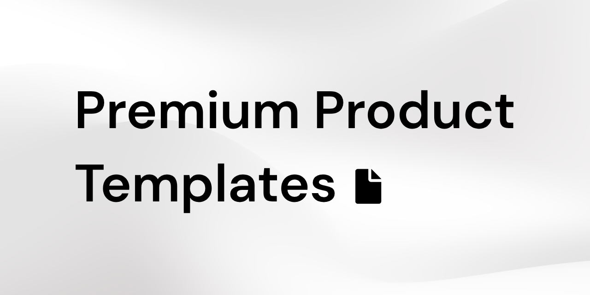

# premium-product-templates

> A six-file template system that turns any AI agent into a reliable premium-grade product builder.

[](LICENSE)  

Brand identity slots into ~30 fields per project. The rest — design tokens, component specs, page patterns, voice rules, accessibility floors — is pre-decided based on what premium design teams actually do. Hand the filled-in files to any AI tool (Claude, Cursor, ChatGPT, Cody, others) as the single source of truth.

The system is built from ~4,000 lines of cross-referenced research on what makes premium product design measurably different from generic SaaS-template output. It's the thing I wish existed before I started building it.

---

## TL;DR

- **6 markdown templates** covering brand context, design system, content / layout, and orchestration
- **Web and mobile** treated as parallel systems with shared brand identity
- **Brand-agnostic** — works for any project; you fill in slots
- **Free, MIT licensed, provided as-is** — fork, adapt, ship anything you want
- **Compatible with any AI tool** that reads markdown

---

## The six templates

| File | Purpose | Lines |
| --- | --- | --- |
| **`PROJECT_TEMPLATE.md`** | Entry-point orchestration — tells the AI which sibling files exist and in what priority. Lightweight index. | ~300 |
| **`INFORMATION_TEMPLATE.md`** | Brand identity, audience persona (with anti-personas), business model, voice principles, product features + non-features, social, SEO defaults. The "why" and "who." Shared between web and mobile. | ~500 |
| **`DESIGN_TEMPLATE_WEB.md`** | Visual design system for web — colors (OKLCH), typography, spacing, ~25 component specs, motion, accessibility (APCA + WCAG 2.2). | ~2,300 |
| **`DESIGN_TEMPLATE_MOBILE.md`** | Visual design system for mobile — iOS HIG + Material 3 native specs, gestures, haptics, safe areas, Dynamic Type / sp scaling. | ~1,800 |
| **`SPEC_TEMPLATE_WEB.md`** | Site map + per-page content/layout/copy + forms + system messages + transactional email + legal pages + analytics events. | ~950 |
| **`SPEC_TEMPLATE_MOBILE.md`** | App map + per-screen content/copy/states + onboarding + auth + permission pre-prompts + push notifications + app store metadata. | ~860 |

Plus one reference file:

| File | Purpose |
| --- | --- |
| `research.md` | The brand-agnostic premium-standard research (23 sections, ~4,000 lines) — the explanatory backing for everything in the templates. DESIGN templates cite specific sections. |

---

## Why this exists

Most AI tools, given a prompt like "build a pricing page," regress toward generic SaaS output — because they average across millions of mediocre examples in their training data. Without an anchor, even capable models produce drift between sessions, between tools, and between pages of the same project.

These templates are that anchor. They encode:

- **Universal rules** that don't change between projects (accessibility floor, anti-patterns, scale systems, the AI Agent Contract)
- **Structural defaults** representing the broad-premium-middle of what mature design teams choose
- **Brand-specific slots** you fill in per project

The AI now references concrete tokens (`{colors.primary.9}`, `{spacing.scale.4}`, `{typography.roles.body-md}`) instead of guessing. Every session lands on the same answer. Cross-page, cross-tool, cross-team consistency becomes the default rather than a constant battle.

---

## What this system actually handles

Each template is operational, not aspirational. Specifically:

- **Colors** — OKLCH authoring, 12-step Radix scale, APCA contrast targets, dark-mode strategy (perceptually mapped, not inverted), surface hierarchy
- **Typography** — 8 semantic type roles, modular scale ratios, line-height + tracking inverse rules, variable fonts, fluid `clamp()` sizing
- **Spacing** — 4 px base, 18-step scale, inset/stack/inline patterns, container queries
- **Shapes** — 6-step radius scale, nested-radius math, continuous corners on iOS
- **Elevation** — 6-level layered shadows (web) / materials + M3 elevation (mobile)
- **Motion** — 5 duration tokens, 4 easings, 3 spring presets, FLIP, View Transitions API, reduced-motion variants
- **States** — 10 canonical states, focus-visible spec, touch states (iOS dim / Android ripple), disabled-without-opacity
- **Iconography** — 6 sizes, stroke-to-text-weight pairing, optical alignment, recommended free + premium libraries (Lucide / Phosphor / HugeIcons)
- **Imagery** — 6 aspect ratios, modern image loading (AVIF/WebP/JPG, srcset, fetchpriority)
- **Accessibility** — WCAG 2.2 + APCA contrast targets, all 6 preference media queries (including `forced-colors`), live regions, skip links
- **~25 components** (web) / ~22 components (mobile) — pixel-perfect specs with state matrices for every common atom and molecule
- **Web patterns** — canonical landing composition, hero variants, scroll-triggered animation framework, bento grids, command palette, code surfaces
- **Mobile patterns** — iOS HIG + Material 3 native conventions, gestures, haptics, safe areas, permissions pre-prompting
- **Data visualization** — three-palette system (categorical / sequential / diverging), chart-type conventions
- **Internationalization & RTL** — CSS logical properties, mirror rules, tall-script line-height, CJK exceptions, locale formatting
- **Microcopy** — voice principles, banned-word list, length budgets, premium positioning structure
- **AI Agent Contract** — 23 hard rules (web) / 16 hard rules (mobile) the AI must follow

---

## Quick start

### Web project

```bash
# 1. Get the templates
curl -O https://raw.githubusercontent.com/arshawnarbabi/premium-product-templates/main/PROJECT_TEMPLATE.md
curl -O https://raw.githubusercontent.com/arshawnarbabi/premium-product-templates/main/INFORMATION_TEMPLATE.md
curl -O https://raw.githubusercontent.com/arshawnarbabi/premium-product-templates/main/DESIGN_TEMPLATE_WEB.md
curl -O https://raw.githubusercontent.com/arshawnarbabi/premium-product-templates/main/SPEC_TEMPLATE_WEB.md

# 2. Rename to project files
mv PROJECT_TEMPLATE.md PROJECT.md
mv INFORMATION_TEMPLATE.md INFORMATION.md
mv DESIGN_TEMPLATE_WEB.md DESIGN.md
mv SPEC_TEMPLATE_WEB.md SPEC.md

# 3. Fill the brand-identity slots. Greppable until clean:
grep -n "<[^>]*>" PROJECT.md INFORMATION.md DESIGN.md SPEC.md

# 4. For DESIGN.md, generate the 12-step color palette from your brand color
#    (algorithm in §Colors → Generating the scale). Or ask your AI to do it.

# 5. Hand all four files to your AI tool. PROJECT.md is the entry point.
```

### Mobile project

Same pattern but with `DESIGN_TEMPLATE_MOBILE.md` → `DESIGN_MOBILE.md` and `SPEC_TEMPLATE_MOBILE.md` → `SPEC_MOBILE.md`.

### Web + mobile in one project

Use all six files. The brand-identity slots in `INFORMATION.md` are shared — fill once. The visual / content templates split by platform.

---

## Guided fill-in (new in v1.2)

You don't have to fill the templates manually. Once they're copied into your project, ask your AI:

> "Help me populate these templates"

It produces a **structured intake form** — must-fill brand identity at the top, customizable defaults below — covering every decision you need to make. Answer in your own time. The AI fills the templates for you, derives the 12-step color palette + dark mode counterpart, propagates shared values across all 6 templates, and runs final verification.

Trigger phrases the AI listens for: *"help me populate this"* / *"what do you need to know?"* / *"run the intake"* / *"walk me through this"*.

The full Interactive Population Protocol lives in `PROJECT.md`. See it for the exact intake structure, behavioral steps, and cross-template consistency rules.

---

## How to point AI at this system

In your AI prompt, reference the entry-point file. The AI discovers the rest via `PROJECT.md`'s declarations.

```
Use the templates in this project as your source of truth.
Start by reading PROJECT.md, then consult the files it declares in the
priority order it specifies. Reference tokens via {group.path} syntax;
never invent values not in the documents.

Now build me a [pricing page | onboarding flow | settings screen | …].
```

**Tool conventions:** rename `PROJECT.md` to match what your tool auto-discovers:

| Tool | File name |
| --- | --- |
| Claude Code | `CLAUDE.md` |
| Cursor | `.cursorrules` |
| Generic AI-agent tools | `AGENTS.md` |
| Continue.dev | `.continuerules` |

Content stays the same.

---

## What you actually decide per new project

**Required brand inputs (~10 fields — no defaults work):**
Brand name, description, audience, voice, brand primary color (OKLCH), brand neutral hue, display + body + mono font families, project type (marketing site / product SaaS / mobile app / hybrid).

**Profile selections (9 profiles — all have premium defaults):**
Radius, type scale ratio, density, motion personality, elevation depth, color saturation, brand warmth, section padding, chart minimalism.

**Pick-one slots (~22 web / ~14 mobile — all have defaults):**
Input style, tabs style, icon fill, avatar shape, modal backdrop, code surface, onboarding pattern, save model, settings IA, command palette, RTL support, chart library, illustration style, and others.

**SPEC content (per-project, no defaults):**
Site map / app map, page sections, copy, voice samples, forms, notifications, email templates, app store metadata.

**INFORMATION content (per-project, no defaults):**
Audience persona depth, market positioning, business model, brand story, social handles, legal jurisdiction.

**Total decisions to fully configure a project:** ~30 quick decisions + writing the actual content/copy. Most decisions take seconds; the content takes real time (as it should).

---

## The three-tier model

| Tier | What | How it appears |
| --- | --- | --- |
| **Universal** | Hardcoded; immutable per project | "Spacing values must be multiples of base"; "Use APCA for contrast"; "Touch targets ≥ 44 pt mobile" |
| **Structural default** | Pre-filled, sensible, overridable | "Type scale ratio: balanced (1.200)"; "Modal backdrop: blur"; "Onboarding: empty-state-driven" |
| **Brand-specific** | Empty `<slot>` per project | Brand colors, font families, audience, voice, page content |

---

## Recommended tech stack defaults (override per project in `PROJECT.md`)

| Concern | Default |
| --- | --- |
| Framework (web) | React + Next.js (App Router) |
| Styling | Tailwind v4 |
| UI primitives | shadcn/ui (dashboards / product apps); custom for marketing |
| Animation | Framer Motion |
| Forms | React Hook Form + Zod |
| Icons | Lucide (free default) / Phosphor / **HugeIcons** (premium tier — 51K icons, 10 styles) — declare per project |
| Deploy | Vercel |
| Mobile native | SwiftUI / Jetpack Compose, or React Native (Expo) for cross-platform |

---

## Where the rules come from

`research.md` documents the source for every rule. Key references:

- **Published premium design systems:** Radix Colors, Material 3, Apple HIG, IBM Carbon, Atlassian Design System, Shopify Polaris, Geist (Vercel)
- **Standards:** DTCG W3C Design Tokens Format Module (stable Oct 2025), OKLCH color, APCA contrast, CSS logical properties, View Transitions API, container queries
- **Practitioner content:** Karri Saarinen's 10 rules of craft, Rauno Freiberg's interaction principles ("Devouring Details"), Vercel's published "Web Interface Guidelines"
- **Production-site analysis:** Linear, Vercel, Stripe, Notion, Anthropic, Mercury, and Pixel Point's case-study portfolio

The research file is informational — you don't need it to use the templates. It's the explanatory backing if anyone asks "why this rule?"

---

## Versioning

All templates carry `template_version: "1.0.0"` in their YAML frontmatter. Per-project instances should preserve this field — when the template family evolves, projects can track which version they were authored against.

This release: **v1.0.0** — stable. Future updates follow [semantic versioning](https://semver.org/).

---

## Contributing

Issues and discussions welcome. PRs welcome but not promised. This is maintained as time permits.

If you ship something with this and want to share, drop a link in a discussion — I'd love to see what people build.

---

## License

[MIT](LICENSE) © 2026 Arshawn Arbabi

**Provided as-is.** Free to use, fork, adapt, and ship anything you want. No attribution required (though appreciated). No warranty. No support obligation on my end — though I'll engage with the community when I can.

---

## Acknowledgements

Built standing on the shoulders of public design system documentation from Radix, Tailwind, Material, Apple, Atlassian, Shopify, and Vercel. Practitioner principles from Karri Saarinen (Linear) and Rauno Freiberg (Vercel). The DTCG W3C Design Tokens working group. Every team that publishes their design system openly — you make work like this possible.
